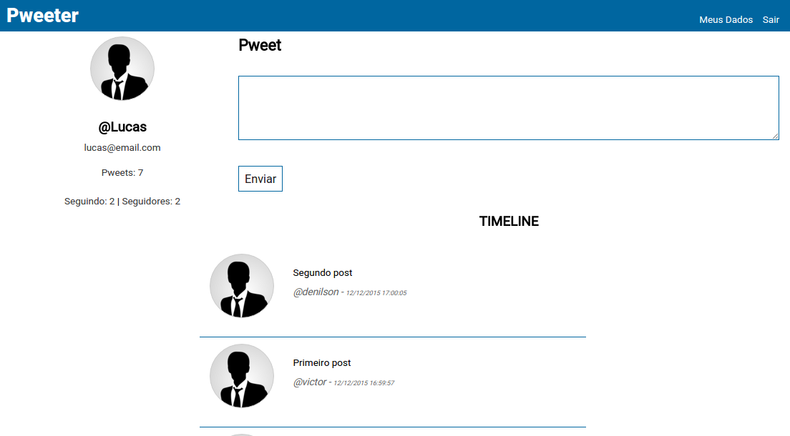

## Pwitter - CodeIgniter

Projeto do módulo de PHP da Pós Graduação UNISAL

## Instalação

**1.** Clonar repositório

`git clone https://github.com/deoliveiralucas/pwitter-code-igniter.git`

**2.** Criar banco de dados

`[Clique aqui para acessar o SQL](https://github.com/deoliveiralucas/pwitter-code-igniter/blob/master/database.sql)`

## Screenshot

## Grupo

- [Denilson](https://github.com/Deniilson)
- [Fernando](https://github.com/fernandomaximo)
- [Lucas](https://github.com/deoliveiralucas)
- [Victor](https://github.com/victorrennan)
